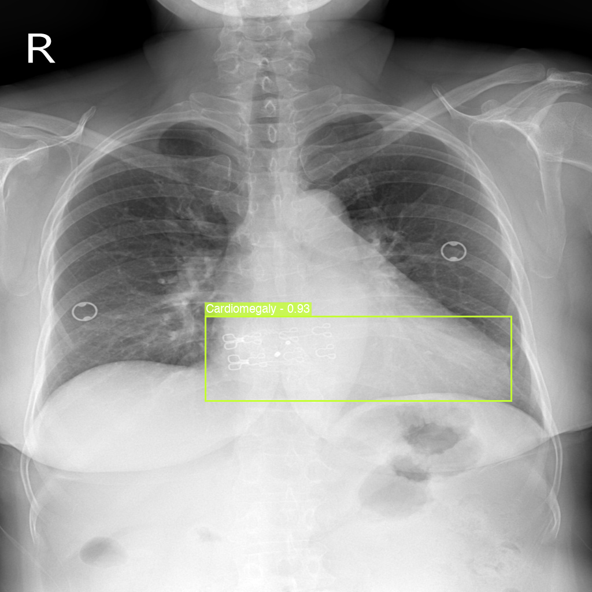
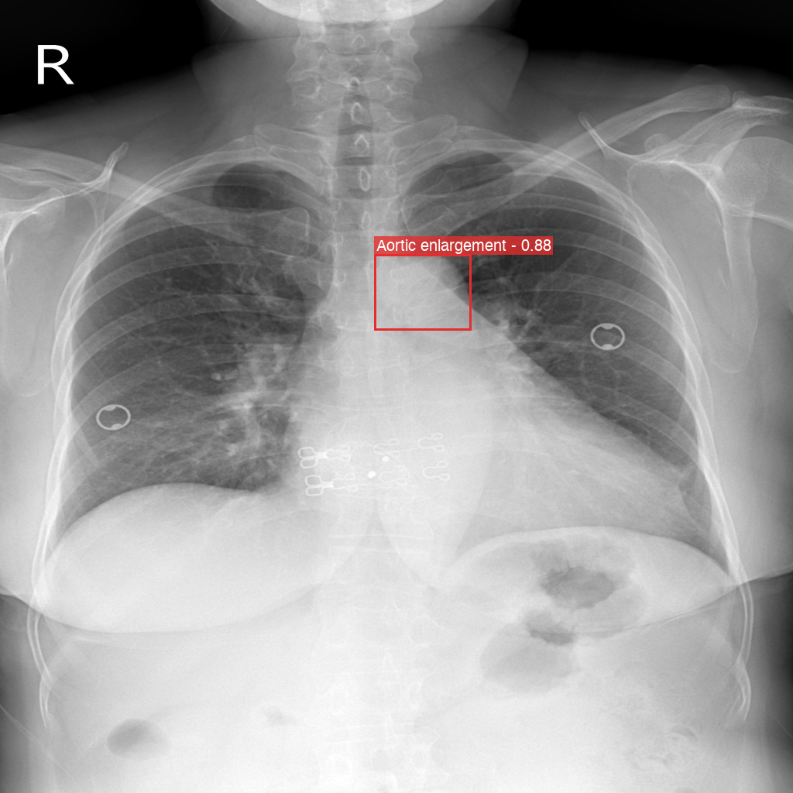
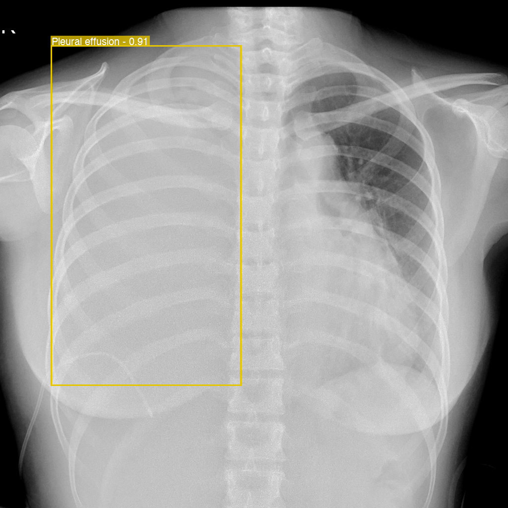
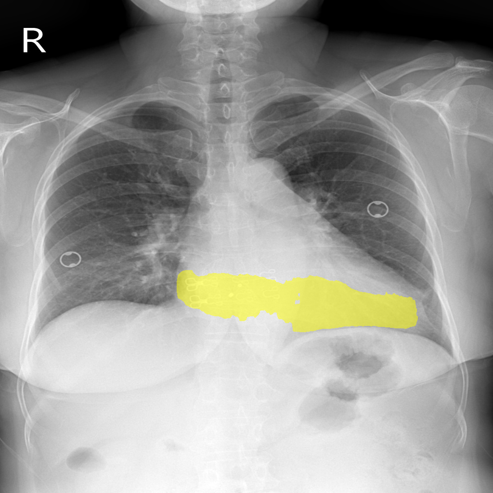
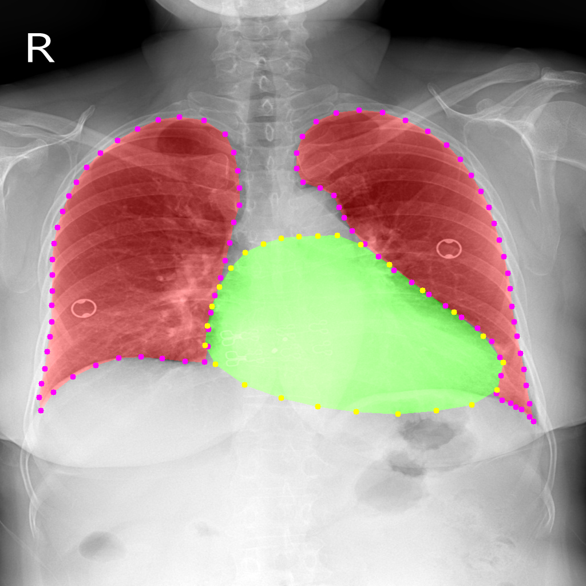

# MedMARS — Medical Multi-agent Reasoning System

MedMARS is an agentic medical visual question answering (VQA) system specialized for chest X-ray analysis. Given a radiograph and a clinical question, it plans a diagnostic workflow, calls specialized vision models (detection, segmentation, classification, VQA), and synthesizes the results into a radiologist-style report with bounding boxes, segmentation overlays, and clinical reasoning.

---

## Highlights

- **Agentic pipeline**: Planner → Coder → Executor → Reporter — each step is an LLM-driven module with its own prompt and role.
- **Multiple vision backbones**:
  - **BiomedCLIP** for zero-shot chest disease classification.
  - **DEIM (D-FINE)** for abnormality detection on VinDr-CXR categories — **self-trained** on VinBigData CXR; the checkpoint is not shipped with the repo (see [Installation §5](#5-place-the-deim-checkpoint)).
  - **MedSAM** for prompted segmentation of detected abnormal regions.
  - **HybridGNet** for lung & heart anatomical segmentation.
- **Tool-calling via Python**: the Coder emits an `execute_command(image_path)` function that orchestrates `ImagePatch` methods; results feed back into the Reporter.
- **Dual LLM backend**: Azure OpenAI or Google Gemini, selected by environment variable.
- **Self-healing execution**: on runtime errors the Coder is re-prompted with the failure trace, up to `max_code_retries` times.
- **Gradio UI** to walk through Plan → Code → Execution → Answer step by step, with embedded overlay images.

---

## Architecture

```
                ┌─────────────┐
   Question ──▶│   Planner   │  (LLM + image, returns <thought> + <plan>)
   + Image     └──────┬──────┘
                      ▼
                ┌─────────────┐
                │    Coder    │  (LLM, returns Python `execute_command`)
                └──────┬──────┘
                      ▼
               ┌───────────────┐
               │   ImagePatch  │  (vision tools)
               │  ┌──────────┐ │
               │  │BiomedCLIP│ │  classification_chest / best_image_match
               │  │  DEIM    │ │  detect_chest_abnormality (boxes)
               │  │ MedSAM   │ │  detect_chest_abnormality (masks)
               │  │HybridGNet│ │  segment_lungs_heart
               │  │Explainer │ │  verify_property (VQA)
               │  └──────────┘ │
               └──────┬────────┘
                      ▼
                ┌─────────────┐
                │  Reporter   │  (LLM → JSON: {answer, reason})
                └──────┬──────┘
                       ▼
              Radiologist-style report
              with <loc_x1_y1_x2_y2> tags
              and embedded overlays
```

### Module map

| Path | Responsibility |
|------|----------------|
| `src/medmars.py` | Top-level orchestrator (`MedMARS.run`) wiring planner → coder → exec → reporter, with retry loop. |
| `src/agent/planner.py` | Vision-aware planner; emits XML-tagged `<thought>` and `<plan>`. |
| `src/agent/coder.py` | Code generator that translates a plan into a `execute_command` Python function. |
| `src/agent/reporter.py` | Synthesizes execution output into structured JSON (`answer`, `reason`). |
| `src/agent/explainer.py` | Vision-language QA over arbitrary images, used as a sub-tool by the coder. |
| `src/image_patch.py` | `ImagePatch` — exposes classification / detection / segmentation / VQA as Python methods to the Coder. |
| `src/vision_models/biomedclip_model.py` | BiomedCLIP wrapper (Hugging Face hub). |
| `src/vision_models/deim_model.py` | DEIM (D-FINE) detector wrapper with overlapping-box merging. |
| `src/vision_models/medsam_model.py` | MedSAM box-prompted segmentation. |
| `src/vision_models/cxr_hybridgnet_segmentation_model.py` | HybridGNet lung/heart segmentation. |
| `src/prompts/*.py` | System prompts for planner / coder / reporter / explainer. |
| `src/constants/constants.py` | VinDr-CXR label set used by classification & detection. |
| `src/constants/env.py` | Environment / path configuration (checkpoint + Azure / Gemini keys). |
| `app_gradio.py` | Gradio web demo exposing the 4-step pipeline. |

---

## Supported findings

Detection (`DEIMModel.CLASS_NAMES`) covers the full 14-class VinDr-CXR label set:

```
Aortic enlargement, Pleural thickening, Pleural effusion, Cardiomegaly,
Lung Opacity, Nodule/Mass, Consolidation, Pulmonary fibrosis,
Infiltration, Atelectasis, Other lesion, ILD, Pneumothorax, Calcification
```

Zero-shot classification (`CHESTMNIST_LABEL` in `src/constants/constants.py`) uses the same set **minus Atelectasis** — 13 labels. The detector can therefore still localize Atelectasis even though the classifier no longer scores it.

The Reporter emits absolute pixel-coordinate bounding boxes as `<loc_x1_y1_x2_y2>` tags so that the UI can re-render them as images.

---

## Example outputs

All images below are real pipeline outputs taken from evaluation runs on VinDr-CXR-VQA (`logs/`) and copied into `sources/examples/`. Images are rendered at the model's working resolution of 1024×1024.

### 1. Abnormality detection (DEIM)

`detect_chest_abnormality()` returns one overlay per detected class, annotated with the label and confidence score.

| Cardiomegaly (0.93) | Aortic enlargement (0.88) |
|---|---|
|  |  |

A high-confidence pleural effusion on a different study — the opacified right hemithorax is boxed at 0.91:



### 2. Prompted segmentation (MedSAM)

Each detected box is fed to MedSAM as a prompt, producing a pixel mask for the finding. Here the cardiac silhouette from the Cardiomegaly box above:



### 3. Anatomical segmentation (HybridGNet)

`segment_lungs_heart()` returns lung (red) and heart (green) contours plus separate `RL_mask.png`, `LL_mask.png`, and `H_mask.png` files. The agent cross-references these with the detection boxes to reason about laterality ("which side?") and cardiothoracic ratio.



### 4. End-to-end run

A representative case from `logs/vindr_cxr_vqa_20251205_142646_range_300_350/vqa_307/report.md`:

> **Question** — What abnormality is visible?
>
> **Plan** — classify with BiomedCLIP → detect + segment with DEIM/MedSAM → keep findings where (classification > 0.05 AND has bbox) OR (detection > 0.5) → explain each confirmed finding.
>
> **Answer** — `Aortic enlargement <loc_500_236_608_338> and cardiomegaly <loc_361_469_806_710> are present.`
>
> **Ground truth** — `Cardiomegaly <loc_1077_1249_2413_2130>` (original resolution; IoU@0.3 = 0.82 after rescaling)

Every evaluation run writes a `report.md` per case with the Thought, Plan, generated code, raw execution output, final answer, ground truth, and metrics — plus all overlay/mask PNGs referenced above.

---

## Installation

### 1. Clone & enter the project

```bash
git clone https://github.com/UncPham/MedMARS
cd MedMARS
```

### 2. Create a virtual environment (Python 3.10+ recommended)

```bash
python -m venv venv
source venv/bin/activate    # Windows: venv\Scripts\activate
```

### 3. Install dependencies

```bash
pip install -r requirements.txt
```

> The requirements include a few packages installed directly from GitHub (CLIP, segment-anything, pydensecrf, detectron2, GLIP). On Apple Silicon some of these need `CMAKE_ARGS` or `xcode-select --install`. On Linux/CUDA a matching PyTorch build is required.

### 4. Pull the vision-model dependencies

Both `DEIM/` and `Chest_x_ray_HybridGNet_Segmentation/` are tracked outside this repo (see `.gitignore`). Clone them into `src/vision_models/`:

```bash
cd src/vision_models
git clone https://github.com/Intellindust-AI-Lab/DEIM
git clone https://huggingface.co/spaces/ngaggion/Chest-x-ray-HybridGNet-Segmentation
cd ../..
```

BiomedCLIP, MedSAM, and the Explainer load their weights from Hugging Face Hub on first use.

### 5. Place the DEIM checkpoint

> **The DEIM detector is self-trained** — unlike BiomedCLIP / MedSAM / HybridGNet, which pull published weights, there is no pretrained checkpoint to download. The detector was fine-tuned in-house on the VinBigData CXR dataset (14 abnormality classes) from the upstream DEIM (D-FINE) HGNetv2-X backbone, so you must supply your own weights.

The detector reads two paths, both resolved in `src/constants/env.py`:

| Constant | Default | Notes |
|---|---|---|
| `DEIM_CHECKPOINT` | `src/checkpoint/best_stg1.pth` | Self-trained weights — **not included in the repo**, place the file yourself. |
| `DEIM_CONFIG` | `src/vision_models/DEIM/configs/deim_dfine/deim_hgnetv2_x_vinbigdata_v3_simple.yml` | Training/inference config. Must stay inside `DEIM/configs/` — it pulls in sibling configs via relative `__include__` paths. |

`DEIMModel` loads EMA weights (`model_ema`) when present, otherwise falls back to `model`. If neither key exists it raises `No model weights found in checkpoint`.

To train your own detector, use the config above with the upstream DEIM training scripts against VinBigData CXR in COCO format (`src/data/vinbigdata-cxr-ad-coco/`), then copy the resulting `best_stg1.pth` into `src/checkpoint/`.

### 6. Configure secrets

Create a `.env` file in the project root:

```dotenv
# Pick one provider
LLM_MODEL=openai            # or "gemini"

# Azure OpenAI
AZURE_OPENAI_API_KEY=...
AZURE_OPENAI_ENDPOINT=https://<your-resource>.openai.azure.com/
AZURE_OPENAI_API_VERSION=2024-08-01-preview
AZURE_OPENAI_DEPLOYMENT=<your-deployment-name>

# Google Gemini (only required when LLM_MODEL=gemini)
GEMINI_API_KEY=...
GEMINI_MODEL=gemini-1.5-pro
```

Required env vars are read in `src/constants/env.py` via `python-dotenv`.

---

## Usage

### Run the Gradio demo

```bash
python app_gradio.py
```

The app launches on `http://localhost:7860`. Upload a chest X-ray, type a clinical question (English or Vietnamese), and press **Run full pipeline**. You will see Thought, Plan, Generated code, Raw model output, the final Answer with embedded localization tags, and a gallery of overlay / mask images.

### Programmatic usage

```python
from src.medmars import MedMARS

agent = MedMARS(max_rounds=3, max_code_retries=2)

thought, plan, code, raw_output, result, response = agent.run(
    query="What abnormalities are present in this chest X-ray?",
    image="path/to/cxr.jpg",
    output_dir="static/run_001",   # where overlays + masks are written
)

print(response["answer"])  # short summary with <loc_...> tags
print(response["reason"])  # full radiologist-style explanation
```

### Direct tool calls

If you want to bypass the LLM and call the vision tools directly:

```python
from src.image_patch import ImagePatch

ip = ImagePatch(outputs_dir="static/manual")

# Classify
scores = ip.classification_chest("path/to/cxr.jpg")

# Detect + segment abnormalities (DEIM + MedSAM)
findings = ip.detect_chest_abnormality("path/to/cxr.jpg")

# Lung + heart anatomy
anatomy = ip.segment_lungs_heart("path/to/cxr.jpg")

# Ask an open-ended question with the explainer VLM
answer = ip.verify_property(["path/to/cxr.jpg"], "Is the cardiac silhouette enlarged?")
```

---

## Project layout

```
MedMARS/
├── app_gradio.py                 # Gradio web demo
├── requirements.txt
├── src/
│   ├── medmars.py                # Top-level agent
│   ├── image_patch.py            # Tool surface exposed to generated code
│   ├── agent/
│   │   ├── planner.py
│   │   ├── coder.py
│   │   ├── reporter.py
│   │   └── explainer.py
│   ├── prompts/
│   │   ├── planner_prompt.py
│   │   ├── code_prompt.py
│   │   ├── reporter_prompt.py
│   │   └── explainer_prompt.py
│   ├── vision_models/
│   │   ├── base_model.py
│   │   ├── biomedclip_model.py
│   │   ├── deim_model.py
│   │   ├── deim_detector.py
│   │   ├── medsam_model.py
│   │   ├── cxr_hybridgnet_segmentation_model.py
│   │   ├── midas_model.py
│   │   ├── DEIM/                              # external (gitignored)
│   │   └── Chest_x_ray_HybridGNet_Segmentation/  # external (gitignored)
│   ├── constants/
│   │   ├── constants.py
│   │   └── env.py
│   ├── checkpoint/
│   │   └── best_stg1.pth         # DEIM weights
│   ├── data/                     # datasets (vindr_cxr_vqa, vqa_rad, slake, path_vqa, ...)
│   └── static/                   # default output dir for overlays / masks
├── sources/
│   └── examples/                 # example pipeline outputs shown in this README
├── Demo/                         # sample images & demo video
└── tests/
    ├── test_vindr_cxr_vqa.py     # eval harness on VinDr-CXR-VQA
    ├── test_medmars_vqa_rad.py   # eval harness on VQA-RAD
    ├── test_deim_detection.py    # detector smoke test
    └── test_bbox_merging.py      # unit tests for the overlapping-box merger
```

---

## Evaluation scripts

| Script | Purpose |
|--------|---------|
| `tests/test_vindr_cxr_vqa.py` | Runs MedMARS end-to-end on the VinDr-CXR-VQA test set; writes a `report.md` + overlays per case into `logs/`. |
| `tests/test_medmars_vqa_rad.py` | Runs MedMARS on the VQA-RAD benchmark. |
| `tests/test_deim_detection.py` | Smoke test for the DEIM detector path. |
| `tests/test_bbox_merging.py` | Unit tests for the overlapping-box merger in `deim_model.py`. |

Each vision-model wrapper is also runnable standalone for a quick check:

```bash
python -m src.vision_models.deim_model <image_path>
python -m src.vision_models.biomedclip_model <image_path>
python -m src.vision_models.medsam_model <image_path>
python -m src.vision_models.cxr_hybridgnet_segmentation_model <image_path>
python -m src.vision_models.deim_detector <image_path> [output_path]
```

---

## Configuration knobs

In `MedMARS(...)`:

- `max_rounds` — maximum planner re-plan rounds (currently the planner is called once; the field is reserved for multi-round planning).
- `max_code_retries` — number of times the Coder is re-prompted with the previous error when `execute_command` raises.

In `ImagePatch(...)`:

- `outputs_dir` — directory where overlays, masks, and visualizations are written. Defaults to `STATIC_FOLDER` (`src/static/`).

The Reporter currently outputs the explanation **in Vietnamese** (see the last line of `src/prompts/reporter_prompt.py`). Change that prompt if you need English output.

---

## Troubleshooting

- **`execute_command function not found`** — the Coder LLM produced code without an `execute_command` function. Increase `max_code_retries` or inspect the printed code.
- **`No response candidates returned from Gemini API`** / safety blocks — Gemini occasionally refuses medical content; switch to `LLM_MODEL=openai`.
- **Missing DEIM / HybridGNet imports** — make sure the two repos are cloned under `src/vision_models/` (they are gitignored).
- **CUDA OOM** — the vision pipeline loads BiomedCLIP, MedSAM, HybridGNet, and DEIM concurrently. Run on a 16 GB+ GPU or instantiate `ImagePatch` lazily.

---

## License

This project is research code. The third-party model weights (BiomedCLIP, MedSAM, HybridGNet, DEIM, etc.) keep their original licenses; check each upstream repository before redistribution.

---

## Disclaimer

MedMARS is a research prototype. It is **not** a medical device and must not be used for diagnostic decisions on real patients without expert oversight.
